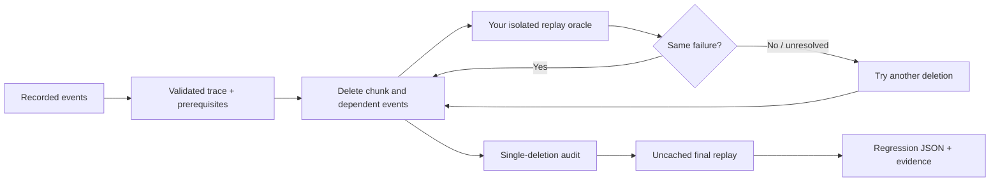

<div align="center">

# ✂ CaseCrop

### Less trace. Same bug.

Shrink a recorded execution into a small regression case.<br />Keep the prerequisites. Keep the failure. Keep the evidence.

[**Open the live lab →**](https://casecrop-shi1720.sg127977958.chatgpt.site) · [Quickstart](https://casecrop-shi1720.sg127977958.chatgpt.site/docs) · [API](docs/reference.md) · [Architecture](docs/architecture.md) · [Project pitch](docs/portfolio.md)

[](https://github.com/shi1720/casecrop/actions/workflows/ci.yml)


[](LICENSE)

</div>

Your agent ran 200 steps. The final state is wrong. Which steps actually matter?

Deleting half the trace is easy. Deleting half **without removing required setup, accepting an unrelated crash, or claiming a flaky result is verified** is the difficult part.

CaseCrop is a zero-dependency Python library that repeatedly replays smaller candidates, accepts only the same failure, and audits what remains. Bring your own replay function. Keep a regression case you can actually understand.

```text
$ casecrop demo --case cache --require-minimal
36 → 6 events | 90 oracle calls | complete
Failure: cache.cross_tenant
Confirmed: True | Closure 1-minimal: True
```

[](https://casecrop-shi1720.sg127977958.chatgpt.site)

## Try it in one minute

Python 3.10+. No model, API key, Docker daemon, or runtime dependency.

```bash
# Tagged source install. v0.1.0 is not published on PyPI.
pip install "casecrop @ git+https://github.com/shi1720/casecrop.git@v0.1.0"

casecrop demo --case cache --output incident --require-minimal
pip install pytest
python -m pytest incident/test_regression.py
```

The generated test proves that the minimized trace reproduces the buggy cache and passes the reference fix. Output also contains `reduced.json` and `report.json`. Choose a fresh output directory for another run; existing artifacts are protected.

Or open the [browser lab](https://casecrop-shi1720.sg127977958.chatgpt.site). It executes the **same Python source** in a local Pyodide Web Worker. Choose a bug, add noise, constrain the budget, inspect every trial, and export evidence. The initial view is a labeled, previously executed example; press **Crop this case** to execute a new reduction.

## A small API

```python
from casecrop import Event, Outcome, Trace, minimize

trace = Trace([
    Event("setup", {"op": "create"}),
    Event("noise", {"op": "log"}),
    Event("trigger", {"op": "read"}, requires=("setup",)),
])

# A teaching oracle. Replace with isolated application replay.
def replay(events):
    ids = {event.id for event in events}
    return Outcome.fail("my-bug.v1") if "trigger" in ids else Outcome.pass_()

result = minimize(trace, replay, max_calls=200)
assert result.reduced.ids == ("setup", "trigger")
assert result.one_minimal
result.reduced.save("regression.json")
result.save("evidence.json")
```

The application owns replay, including resetting state. CaseCrop owns the reduction experiment. Unexpected oracle exceptions propagate; returning a boolean is rejected because it cannot distinguish a pass from an invalid experiment.

### Connect a real application

The [cart integration](examples/cart_workflow.py) is independent of the bundled systems. It converts application logs to events, reproduces a negative total caused by stacked coupons, reduces six operations to three, and validates a corrected implementation.

```bash
git clone https://github.com/shi1720/casecrop.git
cd casecrop
python -m pip install -e '.[test]'
python examples/cart_workflow.py
python -m pytest examples/test_cart_regression.py

casecrop reduce examples/cart_trace.json \
  --output cart-incident --require-minimal \
  --oracle python examples/cart_oracle.py '{trace}'
```

Your replay program can be written in any language that reads JSON and emits the [outcome protocol](docs/reference.md#commandoracle). There are no claimed Java, Rust, or TypeScript oracle adapters in this release; the included integration is Python.

## What it gives you

| Capability | Why it matters |
|---|---|
| Explicit prerequisites and pinned events | Removing a create cannot leave a dependent read dangling. Pinning a fixture protects its ancestry. |
| Same-failure signatures | A missing fixture or unrelated exception never counts as reproducing your bug. |
| Fail / pass / unresolved outcomes | Infrastructure problems cannot silently become passing tests. |
| Repeated observations and fresh final replay | Inconsistent candidates are rejected; final confirmation bypasses cached observations. |
| Physical invocation budgets | Baseline, repetitions, audit, and confirmation all consume the same budget. |
| Closure deletion witnesses | See why each permitted single-event deletion failed to preserve the bug. |
| Immutable, detached JSON payloads | Accidental oracle mutation cannot silently change future experiments. |
| Command oracle + CLI | Plug an existing replay executable into the same reduction engine. |
| Portable evidence | Export the source trace, reduced trace, signature, configuration, trials, and audit. |
| Real Python in the browser | The lab and library execute one implementation and have report-parity tests. |

## The examples are actual bugs

| Case | Defect | Reduced case | Corrected control |
|---|---|---:|---|
| Cross-tenant cache | Cache key omits tenant identity | 36 → 6 events | Key by `(tenant, resource)` |
| Lost update | Two workers write stale snapshots | 35 → 5 events | Apply an atomic increment in the modeled interleaving |
| Stale permission | Revocation leaves cached allow | 34 → 4 events | Invalidate cached decisions |
| Cart integration | Stacked discounts make total negative | 6 → 3 events | Cap total at zero |

These are small in-memory systems with deterministic replay. They do not evaluate LLM reasoning or claim to model production-scale distributed systems. The numbers are event counts from bundled workloads, not comparisons against other tools.

## Three outcomes, one target

```python
Outcome.fail("cache.cross_tenant")  # The specific invariant was violated.
Outcome.pass_()                     # Valid replay; target is absent.
Outcome.unresolved("fixture down")  # No trustworthy conclusion.
```

The original trace must consistently fail. CaseCrop learns its signature or enforces your explicit `signature=`. A different failure becomes unresolved. With `repeats=3`, all observations must agree on verdict and signature. Unresolved results are retried, not cached as stable facts.

The final trace is replayed again without using the cache. If this replay does not reproduce the target, the result is `unstable`, not verified. Repeats can detect some flakiness; they cannot prove determinism.

## What “minimal” actually means

For a deterministic oracle and a completed audit:

> No permitted single-event deletion, together with its dependent events, retains the target failure.

This is **closure 1-minimality** relative to your prerequisites and pinned setup. It is not the globally shortest trace, proof of root cause, or verification of your oracle. A nonmonotonic bug can have a smaller reproducer that local deletion cannot reach.

| Status | Interpretation |
|---|---|
| `complete` | Fresh reproduction and deletion audit completed. |
| `budget_exhausted` | Last accepted failing candidate retained; verification incomplete. |
| `unresolved` | Final reproduction confirmed, but some deletion trials have no trustworthy verdict. |
| `unstable` | Fresh final replay did not reproduce the target. |

Check `result.one_minimal` before treating an artifact as fully audited. In CI, use `--require-minimal` to exit nonzero when verification is incomplete.

## Architecture



See [architecture](docs/architecture.md) for search behavior, complexity, caching, concurrency assumptions, subprocess handling, artifact trust, and browser deployment. See [design and prior work](docs/design.md) for the relationship to delta debugging, dependency-graph reduction, Picire, Picireny, and Hypothesis. This project credits existing research and does not claim a new algorithmic category.

## Develop and verify

```bash
python -m venv .venv
source .venv/bin/activate
python -m pip install -e '.[test]'
python -m coverage run --source=casecrop -m pytest
python -m coverage report --fail-under=95
python -m pytest examples/test_cart_regression.py
ruff check src tests examples scripts
mypy src/casecrop
python -m build
python scripts/bundle_engine.py --check
python scripts/benchmark.py

# Website: Node 22.13+
npm ci
npm run typecheck
npm run lint
npm run test:engine
npm run build
npx playwright install chromium
npm run test:e2e
```

CI covers Python 3.10–3.14, types, lint, property tests, package build, exact browser-source parity, website build, and desktop/mobile browser workflows. [Validation notes](docs/validation.md) describe the checks, independent review findings, performance evidence, and remaining boundaries. Test and build outputs—not badges or claims of adoption—are the evidence.

## Boundaries

- **Beta, v0.1.0.** No production adoption, stable 1.x API, or universal correctness claim.
- Replay must use fresh, isolated state. Live side effects are your responsibility. CaseCrop does not discover dependencies, capture arbitrary I/O, or sandbox code.
- A call budget cannot stop a hung synchronous callback. The command adapter monitors process time/output and performs POSIX group cleanup, with documented limits.
- JSON artifacts contain payloads. No automatic redaction is performed. Sanitize before recording and sharing.
- Python traces support up to 10,000 events and 8 MB of canonical JSON. Evidence storage can grow with trial count and trace size. Browser limits are smaller.
- Browser JSON is validated as raw text by Python. Integers outside JavaScript's safe range are rejected in the lab; use the Python API for those traces.
- `cost` is descriptive metadata, not a promise of weighted optimization.
- Parallel search, async callbacks, persistent checkpoints, automatic trace capture, and framework-specific adapters are outside this release.

## Contribute

Bring a real failing trace, a broken control, a corrected control, and an oracle that tells them apart. Start with [CONTRIBUTING.md](CONTRIBUTING.md). [MIT licensed](LICENSE).

Built by [Shivam Gupta](https://github.com/shi1720), with AI-assisted implementation and independent adversarial review. The [project pitch](docs/portfolio.md) includes a walkthrough and explains its relevance to reproducible software engineering environments.
