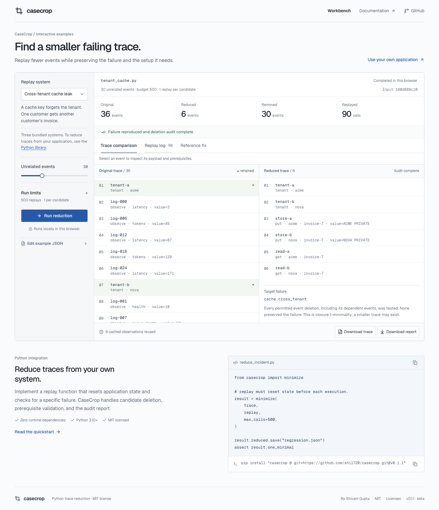
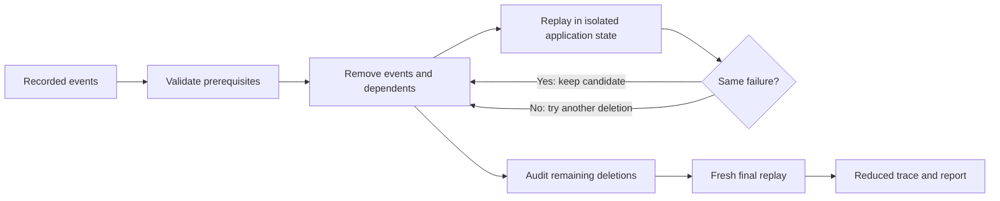

# CaseCrop

**Reduce a failing execution to a smaller regression case.**

CaseCrop is a Python library for engineers who already have a failing trace and a way to replay it. It removes events, preserves their declared prerequisites, and keeps a candidate only when the same failure occurs again.

Use it after an agent workflow, stateful test, or API sequence fails. The output is a smaller input to debug, plus a report explaining which candidates were tried and what each replay returned.

[Workbench](https://casecrop-shi1720.sg127977958.chatgpt.site) · [Quickstart](https://casecrop-shi1720.sg127977958.chatgpt.site/docs) · [API reference](docs/reference.md) · [Architecture](docs/architecture.md)

[](https://github.com/shi1720/casecrop/actions/workflows/ci.yml)
[](LICENSE)

[](https://casecrop-shi1720.sg127977958.chatgpt.site)

## Install and run

Requires Python 3.10 or newer. The library has no runtime dependencies. Install v0.1.1 from GitHub; it is not published on PyPI.

```bash
pip install "casecrop @ git+https://github.com/shi1720/casecrop.git@v0.1.1"
casecrop demo --case cache --output incident --require-minimal
```

```text
36 → 6 events | 90 oracle calls | complete
Failure: cache.cross_tenant
Confirmed: True | Closure 1-minimal: True
```

The command creates `reduced.json`, `report.json`, and an executable regression test. The test reproduces the defect in a cache implementation and checks a reference fix with the same input:

```bash
pip install pytest
python -m pytest incident/test_regression.py
```

Use a fresh output directory for another run; existing artifacts are protected.

The [browser workbench](https://casecrop-shi1720.sg127977958.chatgpt.site) runs the same Python source locally through Pyodide. Select one of three bundled replay systems, choose **Run reduction**, inspect the trace or replay log, and download the result. Initial results are labeled **Saved example result**. Edited browser JSON must use the selected system's operations; connect your own application through the Python API or CLI.

## Connect a replay function

```python
from casecrop import Event, Outcome, Trace, minimize

trace = Trace([
    Event("setup", {"op": "create"}),
    Event("noise", {"op": "log"}),
    Event("trigger", {"op": "read"}, requires=("setup",)),
])

# A small teaching example. Application replay belongs here.
def replay(events):
    ids = {event.id for event in events}
    return Outcome.fail("my-bug.v1") if "trigger" in ids else Outcome.pass_()

result = minimize(trace, replay, max_calls=200)
assert result.reduced.ids == ("setup", "trigger")
assert result.one_minimal
result.reduced.save("regression.json")
result.save("evidence.json")
```

Reset application state on **every** replay. Return one of three outcomes:

```python
Outcome.fail("cache.cross_tenant")  # The target invariant was violated.
Outcome.pass_()                     # Valid replay; the target was absent.
Outcome.unresolved("fixture down")  # Replay could not produce a reliable verdict.
```

The original trace must consistently reproduce a failure. CaseCrop learns that failure's signature, or enforces an explicit `signature=`. A different failure does not qualify. Unexpected callback exceptions propagate instead of being silently treated as passing candidates.

For an application example, [cart_workflow.py](examples/cart_workflow.py) converts a cart's operation log into a trace. Stacked coupons cause a negative total; reduction removes unrelated views and leaves the item and two coupons. A corrected cart caps the total at zero.

```bash
git clone https://github.com/shi1720/casecrop.git
cd casecrop
python -m pip install -e '.[test]'
python examples/cart_workflow.py
python -m pytest examples/test_cart_regression.py
```

You can also connect an existing replay executable:

```bash
casecrop reduce examples/cart_trace.json \
  --output cart-incident --require-minimal \
  --oracle python examples/cart_oracle.py '{trace}'
```

The executable receives a candidate JSON file and returns a JSON outcome. It can be written in any language; see the [command protocol](docs/reference.md#commandoracle). The included integration is Python.

## What the reducer checks

| Mechanism | Purpose |
|---|---|
| Prerequisites and pinned events | Preserve required setup and delete dependents when their prerequisites are removed. |
| Failure signatures | Keep reproducing the original failure, rather than accepting an unrelated crash. |
| Three replay outcomes | Distinguish a passing candidate from a failed experiment. |
| Repeated observations | Reject candidates whose observed verdicts or signatures disagree. |
| Physical call budget | Count baseline, repeats, search, audit, and final confirmation against one limit. |
| Deletion audit | Record what happened when each remaining removable event and its dependents were deleted. |
| Fresh final replay | Confirm the reduced trace without using cached observations. |
| JSON evidence | Retain the input, configuration, candidates, outcomes, and deletion witnesses. |

For a deterministic oracle, a completed audit establishes **closure 1-minimality**: no permitted single-event deletion, together with its dependents, preserves the target failure. A smaller trace may still exist. This is neither a global minimum nor proof of root cause.

| Result status | Meaning |
|---|---|
| `complete` | Fresh reproduction and deletion audit completed. |
| `budget_exhausted` | The call budget ended before verification completed. |
| `unresolved` | Final reproduction succeeded, but some deletion checks have no reliable verdict. |
| `unstable` | The final replay did not reproduce the target. |

Check `result.one_minimal` before relying on the complete audit. Use `--require-minimal` in CI to exit nonzero when verification is incomplete. Repeated observations can reveal inconsistency; they cannot prove determinism.

## Architecture



The Python engine is independent of the website. The browser loads the same source into a Web Worker; parity tests compare complete browser-engine reports with native Python results. [Architecture](docs/architecture.md) covers the search, complexity, process handling, and deployment. [Design notes](docs/design.md) explain the relationship to delta debugging, dependency-graph reduction, Picire, Picireny, and Hypothesis.

## Develop and verify

```bash
python -m venv .venv
source .venv/bin/activate
python -m pip install -e '.[test]'
python -m coverage run --source=casecrop -m pytest
python -m coverage report --fail-under=95
python -m pytest examples/test_cart_regression.py
ruff check src tests examples scripts
mypy src/casecrop
python -m build
python scripts/bundle_engine.py --check
python scripts/benchmark.py

# Website: Node 22.13+
npm ci
npm run typecheck
npm run lint
npm run test:engine
npm run build
npx playwright install chromium
npm run test:e2e
CASECROP_TEST_PRODUCTION=1 npm run test:e2e -- --grep 'executes Python|keyboard operation'
```

CI tests Python 3.10–3.14, types, lint, property tests, package builds, source parity, desktop/mobile workflows, and the built website worker. [Validation notes](docs/validation.md) record the test coverage, review findings, fixes, and benchmark methodology.

## Scope and limits

CaseCrop is a **pre-1.0 library**. It needs a replay function and declared event dependencies; it does not capture arbitrary I/O, infer dependencies, sandbox replay code, or provide framework-specific adapters. Replays run with your process's permissions. A call budget cannot interrupt a hung Python callback; the command adapter has separate time and output limits.

Python traces support up to 10,000 events and 8 MB of canonical JSON. The browser accepts up to 200 events and 256 KB of raw and normalized UTF-8 JSON, and rejects integers outside JavaScript's safe range. Reports include payloads without automatic redaction and can grow substantially with trial count. See [SECURITY.md](SECURITY.md) before using sensitive traces or third-party replay programs.

Parallel search, async callbacks, persistent checkpoints, weighted-cost optimization, and statistical treatment of flaky oracles are outside this release.

## Contribute

A useful contribution starts with a failing trace, a replay function, and a corrected control. See [CONTRIBUTING.md](CONTRIBUTING.md) for setup and review requirements. The project is [MIT licensed](LICENSE).

Created by [Shivam Gupta](https://github.com/shi1720), with AI-assisted development and separate implementation and product reviews. The [engineering walkthrough](docs/portfolio.md) explains the use case, design decisions, and relevance to coding-agent evaluation environments.
