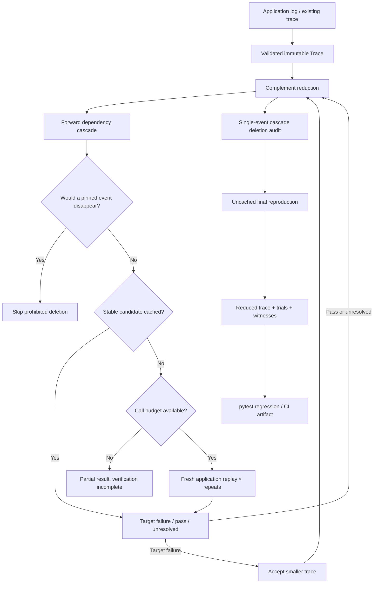
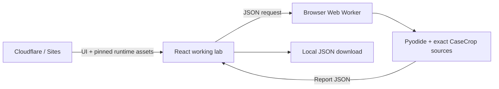

# Architecture

CaseCrop converts a recorded execution into a smaller, dependency-valid regression input. The application supplies the replay oracle; the library supplies deletion search, failure matching, call accounting, and audit evidence.

## Components

| Component | Responsibility |
|---|---|
| `model.py` | Validate ordered events, finite JSON, unique IDs, dependency chronology, immutable detached payloads, canonical serialization and digest. |
| `reducer.py` | Budgeted complement search, forward cascade deletion, stable-result cache, repeated observations, audit witnesses, fresh confirmation. |
| `command.py` | Run an explicit argv without a shell, substitute candidate paths, enforce wall-clock/output admission limits, decode strict JSON outcomes. |
| `cli.py` | Argument parsing, exit semantics, artifact writing, runnable demo fixture generation. |
| `examples.py` | Three executable in-memory defects and their reference corrections. Not framework adapters or model evaluations. |
| `examples/cart_*` | An independent application, log adapter, command oracle, and ordinary pytest regression. |
| React lab | Configure experiments, inspect events and trials, inspect corrected controls, export artifacts. |
| Pyodide worker | Execute the exact Python source bundle in browser WebAssembly. |

The Python package has no runtime dependencies. The website is separate: TypeScript, React, Vinext and Pyodide. Browser-generated and native reports are compared field for field in `scripts/test-engine.mjs`; there is no second reduction algorithm in JavaScript.

## Candidate validity and pins

Each dependency must name an earlier event. This makes every valid trace a topologically ordered DAG and rules out cycles without recursion. To delete a chunk, the reducer scans forward once. Events directly removed or depending on an already removed event join the removed set. If a pinned event would be removed, the candidate is prohibited.

Pinning an event therefore protects its full prerequisite ancestry without rewriting the input. Unpinned dependents of a pinned setup can still be removed. Every submitted candidate retains the original event order and has all its declared prerequisites.

## Search and minimality

The search tests complements of increasingly small chunks. On a successful deletion it starts again with the smaller trace. No global optimum is promised: failure predicates can be nonmonotonic, and an intermediate passing candidate can hide a much smaller failing one.

The final audit tries each single event and its dependent closure. It restarts after any newly accepted reduction. A passing deletion provides a witness; a prohibited deletion is recorded as protected. Any unresolved deletion prevents a minimality claim. A fresh final reproduction bypasses the cache. The guarantee assumes a deterministic oracle and is relative to declared constraints.

## Complexity and performance decisions

A closure scan costs O(n + e) in surviving events and dependency edges. Candidate IDs are tuples in original order, used as cache keys. Materializing and storing candidates costs O(n) per trial. The cache and evidence log can use O(tn) memory for t trials. This is deliberate, inspectable evidence, not a streaming large-scale trace store.

The search can require quadratic oracle calls in difficult cases. Budget bounds physical calls, but not the cost of a single oracle. An adversarial review found accidental cubic bookkeeping in the deletion audit: checking tuple membership for every event inside every witness. Replacing it with a candidate-ID set removed that extra factor. See [validation](validation.md) for measured results and reproduction.

The event `cost` field is descriptive metadata. `Trace.cost` totals it; it does not change search ordering or promise a minimum-cost result. Parallel execution, checkpoint resume, automatic dependency mining, and streaming are outside v0.1.

## Replay contract and execution safety

The callback is trusted application code. It must initialize fresh replay state every time. Unexpected exceptions propagate; the reducer does not label them target failures. An oracle returns `Outcome.fail(signature)`, `Outcome.pass_()`, or `Outcome.unresolved(reason)`.

The first failing signature becomes the target unless explicitly supplied. Repeats must agree on verdict and signature. Unresolved results are not cached. Matching repeated results and an uncached final replay catch some flakiness but do not establish determinism.

`CommandOracle` is process management, not sandboxing. It inherits the invoking environment and operating-system permissions. It redirects output into temporary files, polls wall time and output size, and returns unresolved when limits are observed. On POSIX it kills the child's process group after each invocation, including after a parent exits. Detached processes can evade group cleanup; Windows cleanup covers only the direct process. Use a container or equivalent isolation for untrusted replay code. Output may overshoot the configured threshold between polling intervals.

## Artifact trust

Trace JSON is versioned and strict. Duplicate keys, non-finite numbers, non-string dictionary keys, unknown fields, and invalid graph structure are rejected. Size and depth are bounded. Payload getters return detached data. No pickle, dynamic exception import, or execution from artifact contents is used.

Reports include the source trace, reduced trace, target signature, algorithm ID, caller-provided oracle ID, input digest, config, physical call counts, cached trials, repeated outcomes, and deletion witnesses. The digest identifies content; it is not a signature, attestation, or proof that someone else ran the oracle. Reports are inspectable evidence, not authenticated claims. There is no generic report-loading API in v0.1.

## Website deployment

The hosted Worker serves the website and assets. It never runs user replay code. Browser requests accept only the three bundled systems; custom JSON changes event data for those systems. Input is not sent to an application backend, stored, or used for analytics. The initial result is visibly labeled as a previously executed example; pressing the run button invokes Python locally. Terminating the Web Worker cancels browser computation.
